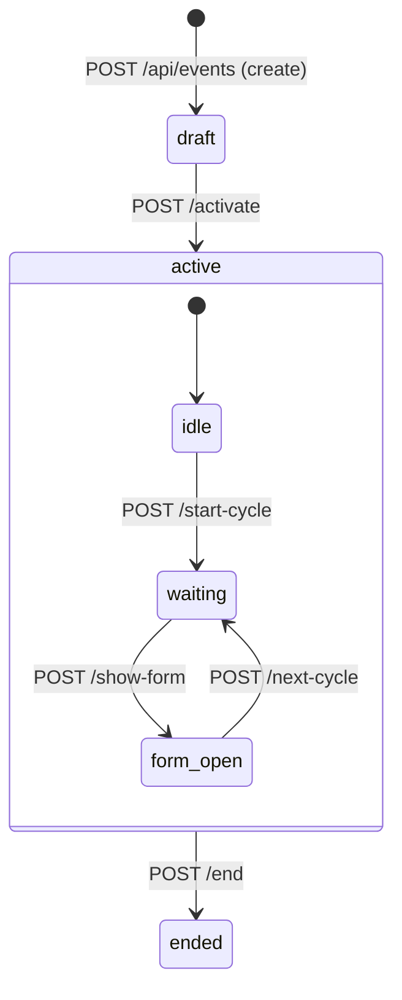
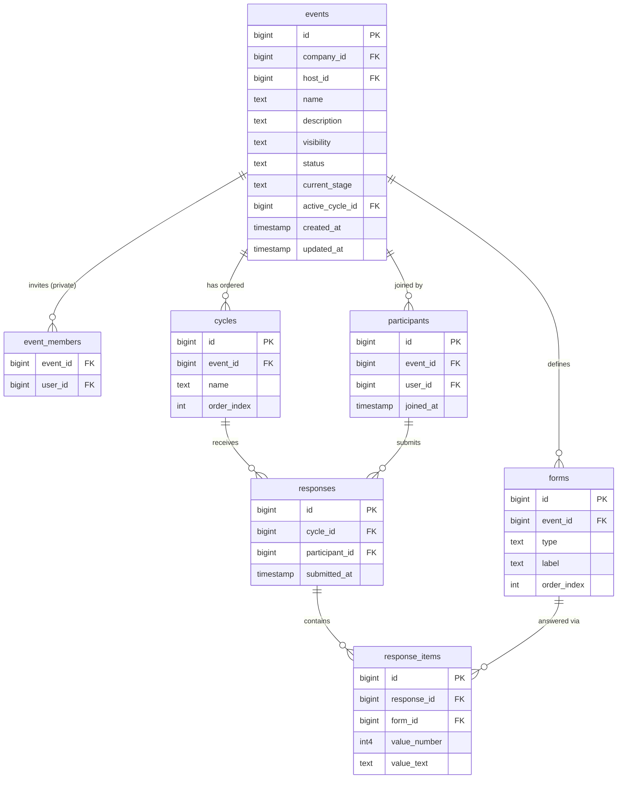
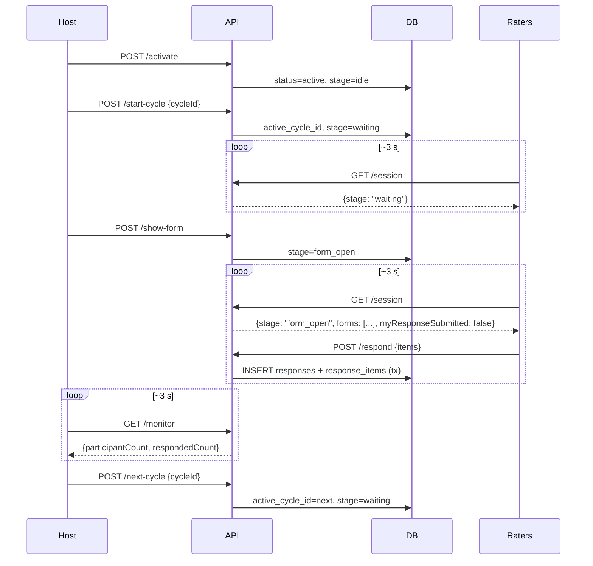

# feat: Live Rating Panel

## Summary

Build a host-controlled live rating system for pitching contests and evaluation panels. Hosts create events with ordered cycles (subjects to rate) and typed forms (rating / mood / free-text), run the session in real-time via a state machine, and view anonymized results with a CSV download when the session ends. Raters join, poll for state changes, fill forms per cycle, and save once per cycle — final, no edits. Real-time sync uses polling (~3 s); no WebSocket.

---

## Problem Frame

The gap being filled is a structured, host-paced evaluation session — juri lomba, panel tasting, pitching contest — where one person controls the pace and all raters give independent numeric and qualitative scores. Slido/Mentimeter handle freeform Q&A; full survey tools are async. This application sits between them: real-time, host-commanded, anonymized results, with all participants already authenticated as company members.

---

## Requirements

### Event & Form Management

- R1. Host creates an event with name (required), optional description, visibility (`public` / `private`), an ordered list of named cycles, and an ordered list of typed forms — all in one API call.
- R2. Events are scoped to the host's currently selected company. Public events are visible to every member of that company; private events are visible only to the host and explicitly invited members.
- R3. Private event members are managed after creation via invite-by-email (find-or-create user, following the existing company invite pattern). Host can also remove members.
- R4. Three form types: `rating` (integer 1–5), `mood` (integer 1–4), `free_text` (string). Each form has a label and an order index. Forms are defined at event level and apply identically to every cycle.

### Session Control

- R5. Host activates an event (`status`: draft → active); raters can join after activation.
- R6. Host starts a cycle (sets `active_cycle_id`, `current_stage` → `waiting`).
- R7. Host opens forms for the active cycle (`current_stage` → `form_open`); raters can fill responses.
- R8. Host advances to the next cycle at any time (`active_cycle_id` updates, `current_stage` → `waiting`). Raters who have not yet responded are excluded from that cycle's averages — not counted as zero.
- R9. Host ends the event (`status` → `ended`) after the last cycle.
- R10. Host polls a monitoring endpoint (~3 s) to see total joined participant count and response count for the active cycle.

### Rater Flow

- R11. Raters join an event by calling a join endpoint; a participant record is created idempotently.
- R12. Raters poll an event-state endpoint (~3 s). The UI automatically transitions: waiting screen when `current_stage=waiting`; form when `current_stage=form_open` and the rater has not yet submitted; waiting screen again after save.
- R13. The form screen shows the active cycle name and all event forms in defined order.
- R14. Rater submits all form answers for a cycle in one Save call. Save is atomic, final, and cannot be undone.
- R15. A rater who has already saved for the current cycle sees the waiting screen regardless of `current_stage`.
- R16. Late-joining and reconnecting raters automatically sync to the current event state via polling.

### Results

- R17. Only the host can access results; results are available only after the event ends.
- R18. Results include an average table: one row per cycle, one column per `rating` / `mood` form. Each cell is the mean of submitted numeric values, excluding non-respondents (not counting them as zero). Free text responses are listed per cycle without author attribution.
- R19. Cycles appear in their defined order (`order_index`) in results — no auto-ranking.
- R20. Host can download a CSV of the results: header row with form labels, one data row per cycle with averages, free text appended in a separate column per form.

---

## Key Technical Decisions

- **Company scope via `RequireSelectedCompany`**: events carry `company_id` from the principal at creation time. All event-management and session-control endpoints require a selected company, following the existing multi-tenant pattern. Queries filter by `company_id` to prevent cross-company access.

- **State machine as two fields on `events`**: `status` (draft / active / ended) + `current_stage` (idle / waiting / form_open). `current_stage` is semantically meaningful only when `status=active`. Keeping them separate allows querying status independently from stage (e.g., filtering ended events needs no stage filter).

- **Atomic response submission**: `POST /respond` inserts one `responses` row plus N `response_items` in a single DB transaction. The existence of the `responses` row is the idempotency lock — no separate "submitted" flag needed. A `UNIQUE(cycle_id, participant_id)` constraint on `responses` enforces one submission per rater per cycle at the DB level.

- **Polling-only real-time**: no WebSocket or SSE. Two lightweight GET endpoints handle hot-path polling — one for raters (`/session`), one for hosts (`/monitor`). Both return minimal JSON from indexed queries. Adequate for the expected scale (dozens of participants per event).

- **On-demand results computation**: averages use SQL `AVG(value_number) FILTER (WHERE value_number IS NOT NULL)` grouped by cycle + form at request time. No stored aggregates. Fast enough at the expected scale, avoids stale precomputed values.

- **No auto-ranking**: per user decision, cycles appear in `order_index` order. The `is_decider` field is not added to forms.

- **CSV via stdlib `encoding/csv`**: handler accesses `http.ResponseWriter` directly through the huma context (`huma.GetContext(ctx).Res`) to write the streaming CSV with `Content-Type: text/csv` and `Content-Disposition: attachment`. No external dependency.

- **Anonymity enforced at the query layer**: host-facing result queries never select `user_id` from `responses` or `response_items`. Free text is returned as a `[]string`, not attributed. No application-layer filtering needed.

- **`internal/rating` import isolation**: the rating package does not import any other domain package. Company membership lookups (for private event access) use direct queries against `company_members`, not the `company` package API. Consistent with the CLAUDE.md cross-domain import restriction.

---

## High-Level Technical Design

### Event State Machine



`POST /end` is valid from any `active` sub-state (`idle`, `waiting`, or `form_open`).

### Data Model



`events.active_cycle_id` is a nullable FK to `cycles.id`, added after both tables exist (circular FK resolved with `ALTER TABLE`).

### Session Sequence (one cycle)



---

## Scope Boundaries

### Deferred to Follow-Up Work
- Export to PDF (CSV ships in v1)
- Media / file attachments on cycle subjects (photo or video for tasting panels)
- Weighted scoring or cross-form normalization
- Revealing results live to raters during the session
- Editing or revoking a rater's response after Save
- App sidebar navigation update to include "Events" link — needed before frontend pages are reachable

### Outside This Product's Identity
- Anonymous (unauthenticated) participant access
- Rater access to other raters' scores or identities at any point
- Auto-ranking of cycles by any computed score

---

## Risks & Dependencies

- **Circular FK between `events` and `cycles`**: `events.active_cycle_id` references `cycles`, but `cycles.event_id` references `events`. Migration must create events without the FK, create cycles, then `ALTER TABLE events ADD CONSTRAINT`. Down migration must drop the FK before dropping either table.
- **sqlc codegen sequencing**: `query.sql` must exist and `sqlc.yaml` must reference it before `make gen` (which runs `make sqlc`). Do not start implementing handler code that calls generated query methods until `make sqlc` has run successfully after U1.
- **SDK regeneration gates frontend units**: frontend (U7, U8) can only use typed API client functions after `make gen-spec && make gen-client` complete, which requires all backend route registrations (U2–U6) to be wired into `internal/platform/routes/routes.go` and `cmd/server/main.go`.
- **Response atomicity**: partial inserts (responses row inserted, items not) must not be visible. The DB transaction in `POST /respond` must cover both inserts.
- **Private event access check performance**: the `EXISTS (SELECT 1 FROM event_members ...)` subquery in the event list query runs for every row. Acceptable at the expected scale; ensure `event_members(event_id, user_id)` has an index.
- **CSV response writer in huma**: writing a non-JSON body requires bypassing huma's typed output and accessing `http.ResponseWriter` via `huma.GetContext(ctx).Res`. Verify this API is stable in the version in `go.mod` before implementing U6.

---

## Implementation Units

### U1. Database Migration

**Goal:** Create the 7 new tables for the rating domain and register the new query file in sqlc config.

**Requirements:** R1–R4 (schema foundation), R8 (exclusion by omission enabled by nullable `responses` row), R14 (atomicity enforced by UNIQUE constraint)

**Dependencies:** none

**Files:**
- `internal/platform/migration/sql/2606251200_add_rating.up.sql` (create)
- `internal/platform/migration/sql/2606251200_add_rating.down.sql` (create)
- `sqlc.yaml` (modify — add `internal/rating/query.sql` to the `queries` list)

**Approach:** Create tables in dependency order to avoid FK resolution issues:

1. `events` — without `active_cycle_id` FK yet; include CHECK constraints for `visibility`, `status`, `current_stage`.
2. `cycles` — FK to `events`.
3. `forms` — FK to `events`; CHECK constraint for `type`.
4. `event_members` — FK to `events` + `users`; UNIQUE(event_id, user_id).
5. `participants` — FK to `events` + `users`; UNIQUE(event_id, user_id).
6. `responses` — FK to `cycles` + `participants`; UNIQUE(cycle_id, participant_id).
7. `response_items` — FK to `responses` + `forms`; nullable `value_number` (INT) and `value_text` (TEXT).
8. `ALTER TABLE events ADD CONSTRAINT fk_active_cycle FOREIGN KEY (active_cycle_id) REFERENCES cycles(id)`.

Down migration: drop FK on `active_cycle_id` first, then drop tables in reverse order (response_items → responses → participants → event_members → forms → cycles → events).

**Patterns to follow:** `internal/platform/migration/sql/2604261204_init.up.sql` (table style, index naming, CHECK syntax, ALTER TABLE FK pattern).

**Test scenarios:**
- Apply the up migration against a clean `orating` DB and verify all 7 tables exist in `\dt`.
- Insert duplicate `(event_id, user_id)` into `participants` — expect unique constraint violation.
- Insert duplicate `(cycle_id, participant_id)` into `responses` — expect unique constraint violation.
- Insert `events.visibility = 'invalid'` — expect CHECK constraint violation.
- Apply the down migration and verify all 7 tables are dropped cleanly.

**Verification:** `make migrate name=add_rating` succeeds; `make check` passes (go vet + JSON tag lint).

---

### U2. Event CRUD Backend

**Goal:** Create, list, and retrieve events (with embedded cycles and forms). Includes private-event member management.

**Requirements:** R1, R2, R3, R4

**Dependencies:** U1

**Files:**
- `internal/rating/handler.go` (create)
- `internal/rating/types.go` (create)
- `internal/rating/setup.go` (create)
- `internal/rating/query.sql` (create)
- `internal/platform/routes/routes.go` (modify — add `rating.Setup` call)
- `cmd/server/main.go` (modify — add `rating.Setup` call)

**Approach:**

`POST /api/events` — requires selected company. Body: `{name, description?, visibility, cycles: [{name}], forms: [{type, label}], members?: [email]}`. Handler runs a DB transaction: insert event → bulk insert cycles (assign order_index from slice position) → bulk insert forms (same) → if private, find-or-create each member user and insert event_members. Returns created event with cycles and forms.

`GET /api/events` — returns events visible to the requesting user in their selected company. Query: events where `company_id = selectedCompanyID AND (visibility = 'public' OR host_id = userID OR EXISTS (SELECT 1 FROM event_members WHERE event_id = events.id AND user_id = userID))`. Order by `created_at DESC`.

`GET /api/events/{id}` — same visibility filter as above, plus `id = $1`. Returns 404 if not visible. Response embeds cycles (ordered by `order_index`) and forms (ordered by `order_index`).

`POST /api/events/{id}/members` — host-only. Body: `{email, name?}`. Find-or-create user by email (pattern from `company.handleInvite`). Insert into `event_members` with ON CONFLICT. Returns 409 if already a member.

`DELETE /api/events/{id}/members/{userId}` — host-only. Deletes the event_members row. Returns 204.

**Patterns to follow:** `internal/company/handler.go` handleInvite (find-or-create user), `internal/company/setup.go` (route registration shape), `internal/auth/query.sql` (AuthFindUserByEmail / AuthCreateUser pattern).

**Test scenarios:**
- `POST /api/events` with valid body (name, 2 cycles, 2 forms) returns 201 with embedded cycles and forms sorted by order_index.
- `POST /api/events` without name returns 400.
- `POST /api/events` with `visibility=private` and a member email inserts into event_members.
- `GET /api/events` for host returns their own public and private events in the selected company.
- `GET /api/events` for a rater who was invited to a private event includes that event.
- `GET /api/events` does not return private events of another user unless invited.
- `GET /api/events/{id}` for a private event by an uninvited user returns 404.
- `POST /api/events/{id}/members` by a non-host returns 403.
- `POST /api/events/{id}/members` with an already-invited email returns 409.

**Verification:** `make gen` succeeds (openapi.json regenerated); endpoints return correct huma-typed shapes; `make check` passes.

---

### U3. Session Control Backend (Host)

**Goal:** State machine transition endpoints — activate, start-cycle, show-form, next-cycle, end.

**Requirements:** R5, R6, R7, R8, R9

**Dependencies:** U2

**Files:**
- `internal/rating/handler.go` (extend)
- `internal/rating/query.sql` (extend)

**Approach:** All five endpoints verify the requesting user is the event host (`host_id = p.UserID`); return 403 otherwise. Invalid state transitions return 422 via `humax.Unprocessable`.

- `POST /api/events/{id}/activate` — validates `status=draft`; sets `status=active, current_stage=idle`.
- `POST /api/events/{id}/start-cycle` — body: `{cycleId}`. Validates `status=active`, verifies the cycle belongs to this event; sets `active_cycle_id=cycleId, current_stage=waiting`.
- `POST /api/events/{id}/show-form` — validates `status=active, current_stage=waiting`; sets `current_stage=form_open`.
- `POST /api/events/{id}/next-cycle` — body: `{cycleId}`. Validates `status=active`; verifies cycle belongs to this event; sets `active_cycle_id=newCycleId, current_stage=waiting`. (Host picks the cycle explicitly — no auto-advance — to support non-sequential use.)
- `POST /api/events/{id}/end` — validates `status=active`; sets `status=ended`.

Each transition is a single UPDATE with a WHERE clause that checks the required precondition (e.g., `WHERE id=$1 AND status='draft'`). If 0 rows affected, return 422.

**Patterns to follow:** `internal/company/handler.go` requireAdmin guard pattern; `humax.Unprocessable` for business-rule violations.

**Test scenarios:**
- `POST /activate` on a draft event by the host returns 204; event `status` is now `active`.
- `POST /activate` by a non-host returns 403.
- `POST /activate` on an already-active event returns 422.
- `POST /activate` on an ended event returns 422.
- `POST /start-cycle` with a cycle from a different event returns 422.
- `POST /show-form` when `current_stage=idle` (no cycle started) returns 422.
- `POST /show-form` when `current_stage=form_open` returns 422.
- `POST /next-cycle` successfully updates `active_cycle_id` and resets `current_stage=waiting`.
- `POST /end` on an active event (any sub-stage) returns 204; `status=ended`.

**Verification:** DB state matches expected after each transition call; all guard violations return the correct error codes; `make check` passes.

---

### U4. Rater Flow Backend

**Goal:** Join endpoint, session state polling, and atomic response submission.

**Requirements:** R11, R12, R13, R14, R15, R16

**Dependencies:** U2

**Files:**
- `internal/rating/handler.go` (extend)
- `internal/rating/query.sql` (extend)

**Approach:**

`POST /api/events/{id}/join` — validates `status=active`. For private events, checks event_members. Inserts into participants with `ON CONFLICT (event_id, user_id) DO NOTHING`, then re-fetches the participant row. Returns participant record with 201 (or 200 on idempotent re-join).

`GET /api/events/{id}/session` — polling endpoint. Fetches event row (status, current_stage, active_cycle_id). If `active_cycle_id` is set, fetches the cycle name. If `current_stage=form_open`, also fetches all forms for the event. Looks up the participant row for the requesting user; if found and a response exists for the current cycle, sets `myResponseSubmitted=true`. Returns:
```json
{
  "currentStage": "form_open",
  "activeCycleId": 5,
  "activeCycleName": "Tim A",
  "myResponseSubmitted": false,
  "forms": [{"id": 1, "type": "rating", "label": "Inovasi", "orderIndex": 0}]
}
```
`forms` is an empty array when `currentStage != form_open`. No participant record is required to call this endpoint (supports the pre-join state check from the event list).

`POST /api/events/{id}/respond` — body: `{items: [{formId, valueNumber?, valueText?}]}`. Validates: `status=active`, `current_stage=form_open`, participant record exists for this user, no existing response for `(active_cycle_id, participantId)`. Uses a DB transaction: insert `responses` → insert each `response_item`. Returns 201. If a response already exists, returns 409 (unique constraint or pre-check).

Validation: each item's `formId` must belong to this event; `valueNumber` must be within the form type's allowed range (rating: 1–5, mood: 1–4) if provided; free_text must have `valueText` set.

**Patterns to follow:** `internal/auth/handler.go` (pgxTimestamp, ON CONFLICT pattern); `internal/company/handler.go` isUniqueViolation for 409 detection.

**Test scenarios:**
- `POST /join` on an active event creates a participant record; calling again returns the same record with no duplicate.
- `POST /join` by an uninvited user on a private event returns 403.
- `POST /join` on a draft event returns 422.
- `GET /session` when `current_stage=waiting` returns `{currentStage: "waiting", forms: []}`.
- `GET /session` when `current_stage=form_open` returns forms list in order.
- `GET /session` after the rater submitted returns `{myResponseSubmitted: true}` even if stage is still `form_open`.
- `POST /respond` with all valid items creates one `responses` row and N `response_items` in the DB.
- `POST /respond` called twice returns 409 on the second call; DB has exactly one response row.
- `POST /respond` when `current_stage=waiting` returns 422.
- `POST /respond` with a `formId` from a different event returns 422.
- `POST /respond` with `valueNumber=6` for a rating form returns 400.

**Verification:** Participant and response rows appear correctly in DB; double-submit is rejected at DB level; `make check` passes.

---

### U5. Host Monitoring Backend

**Goal:** Lightweight polling endpoint returning participant count and response count for the active cycle.

**Requirements:** R10

**Dependencies:** U4 (participants table populated)

**Files:**
- `internal/rating/handler.go` (extend)
- `internal/rating/query.sql` (extend)

**Approach:**

`GET /api/events/{id}/monitor` — host-only. Returns:
```json
{
  "participantCount": 12,
  "respondedCount": 7,
  "activeCycleId": 5
}
```
`participantCount` = `COUNT(*)` from participants where `event_id=$1`. `respondedCount` = `COUNT(*)` from responses joined to cycles where `cycle_id = events.active_cycle_id`. Both counts in a single query using CTEs or a lateral join to avoid two round trips. When `active_cycle_id IS NULL`, `respondedCount=0`.

Ensure `participants(event_id)` and `responses(cycle_id)` indexes exist (added in U1 migration).

**Test scenarios:**
- `GET /monitor` returns `{participantCount: 0, respondedCount: 0}` on a freshly activated event with no joins.
- After 3 raters join: `participantCount=3, respondedCount=0`.
- After 2 of 3 raters submit: `respondedCount=2`.
- After host advances to next cycle: `respondedCount` resets to reflect the new cycle (0 until raters respond).
- `GET /monitor` by a non-host returns 403.

**Verification:** Counts match DB state; no N+1 queries; `make check` passes.

---

### U6. Results & CSV Export Backend

**Goal:** Return the complete results table (averages + free text) and a downloadable CSV once the event ends.

**Requirements:** R17, R18, R19, R20

**Dependencies:** U4

**Files:**
- `internal/rating/handler.go` (extend)
- `internal/rating/query.sql` (extend)

**Approach:**

`GET /api/events/{id}/results` — host-only, requires `status=ended`. Returns:
```json
{
  "cycles": [{"id": 1, "name": "Tim A", "orderIndex": 0}],
  "forms": [{"id": 1, "label": "Inovasi", "type": "rating", "orderIndex": 0}],
  "avgTable": [{"cycleId": 1, "formId": 1, "average": 4.25}],
  "freeTexts": [{"cycleId": 1, "formId": 3, "texts": ["Great energy", "Needs work on pitch deck"]}]
}
```
`average` is `null` when no raters responded to that form+cycle combination. SQL: join `responses → response_items → cycles → forms` grouping by `(cycle_id, form_id)`. Use `AVG(value_number) FILTER (WHERE value_number IS NOT NULL)` for numerics and `array_agg(value_text) FILTER (WHERE value_text IS NOT NULL)` for free text. The query never selects `user_id` — anonymity is at the query layer.

`GET /api/events/{id}/results/export` — host-only, requires `status=ended`. Calls the same data logic, then writes CSV via `encoding/csv` directly to `http.ResponseWriter` (accessed via `huma.GetContext(ctx).Res`). CSV layout:
- Row 1 (header): `Cycle`, then each rating/mood form label, then each free_text form label.
- Rows 2..N (data): cycle name, avg values (empty string if null), free texts joined with ` | `.
- Headers: `Content-Type: text/csv`, `Content-Disposition: attachment; filename="results.csv"`.

**Test scenarios:**
- `GET /results` for event where cycle A has 2 respondents both rating 4: returns `average: 4.0`.
- `GET /results` for cycle B where only 1 of 3 raters responded: `average` reflects that single value.
- `GET /results` for a cycle where nobody responded: `average: null` (not 0).
- `GET /results` for a cycle with 3 free text answers returns 3 strings, no user IDs present.
- `GET /results` by a non-host returns 403.
- `GET /results` on an active (non-ended) event returns 422.
- `GET /results/export` returns `Content-Type: text/csv` and `Content-Disposition: attachment`.
- Parsed CSV from `GET /results/export` has the correct number of rows and header columns.

**Verification:** Averages match manual computation from DB; CSV opens correctly in a spreadsheet tool; `make check` passes.

---

### U7. Frontend — Host Pages

**Goal:** Event list (with create action), create-event wizard, host control panel, and results view with CSV download.

**Requirements:** R1, R3, R5–R10, R17–R20

**Dependencies:** U2–U6 complete, `make gen` run to regenerate TypeScript SDK

**Files:**
- `frontend/src/routes/app/events/+page.svelte` (create — event list)
- `frontend/src/routes/app/events/new/+page.svelte` (create — create wizard)
- `frontend/src/routes/app/events/[id]/control/+page.svelte` (create — host control panel)
- `frontend/src/routes/app/events/[id]/results/+page.svelte` (create — results view)

**Approach:**

`/app/events` — `createQuery` for `GET /api/events`. Shows event cards with status badge and cycle count. "Create event" button for all users (any company member can host). Cards link to `/app/events/[id]/control` for owned events, `/app/events/[id]` for others.

`/app/events/new` — multi-section form using `$state`:
1. Event meta (name, description, visibility toggle).
2. Cycle list (add/remove/reorder cycle names).
3. Form list (add/remove/reorder: type select + label input).
4. Members section (shown only when visibility=private; email inputs).
Submit calls `createEvent` mutation; on success redirect to `/app/events/[id]/control`.

`/app/events/[id]/control` — fetches event detail via `createQuery`. Runs a `setInterval` every 3000 ms calling the monitor endpoint and updating a reactive variable. Shows current state clearly (status chip + stage chip). Renders the contextual action button for the current transition:
- draft + any stage → "Activate"
- active + idle → "Start Cycle" (shows cycle picker dropdown)
- active + waiting → "Show Form"
- active + form_open + more cycles remain → "Next Cycle" (cycle picker)
- active + form_open + no more cycles → "End Event"

Each button calls the matching mutation and refetches event detail on success. Monitor counts display alongside.

`/app/events/[id]/results` — `createQuery` for results; renders an HTML table (cycles as rows, form labels as columns). Null averages render as "—". Free text section per cycle as a bulleted list. CSV download button triggers `window.open('/api/events/{id}/results/export?token=...')` or a fetch → Blob → anchor click pattern to include the auth token.

**Patterns to follow:** `frontend/src/routes/app/team/+page.svelte` (createQuery + createMutation + useQueryClient); `frontend/src/routes/app/dashboard/+page.svelte` (reactive metrics, layout pattern).

**Test scenarios:**
- Create-event form with valid data (name + 2 cycles + 1 form) submits successfully and redirects to control page.
- Setting visibility to `private` reveals the members section.
- Control panel shows "Activate" button for a draft event; clicking it changes status chip to "active".
- After activation, the correct next-state button appears ("Start Cycle").
- Monitor participant and response counts update on screen without full page reload.
- Clicking "End Event" transitions status to ended and navigates to results page.
- Results table shows "—" for cycles with null averages (not "0").
- CSV download link triggers a file download.

**Verification:** Complete host flow works in the browser (create → activate → cycles → end → results → CSV). No TypeScript type errors (`bun run check` passes).

---

### U8. Frontend — Rater Session Pages

**Goal:** Rater-accessible session screen — join, wait, fill forms per cycle, and handle event end.

**Requirements:** R11–R16

**Dependencies:** U2, U4, U7 (event list page exists for navigation), `make gen` run

**Files:**
- `frontend/src/routes/app/events/[id]/+page.svelte` (create — rater session page)

**Approach:**

On mount, fetch `GET /api/events/{id}` to get event detail. If `hostId === currentUserId`, redirect to `/app/events/[id]/control`. Otherwise, render based on event state:

**Pre-join:** if event is active and no participant record for this user (determined by calling `GET /session` and checking for a 404 or a flag), show the event name and a "Join" button. Clicking Join calls `POST /join`; on success, start polling.

**Session screen (post-join):** `setInterval` every 3000 ms calls `GET /session`. Derives the correct view from `currentStage` and `myResponseSubmitted`:
- `waiting` or (`form_open` + `myResponseSubmitted=true`) → waiting screen ("Waiting for next question…" with cycle name if available).
- `form_open` + `myResponseSubmitted=false` → form screen.
- `ended` → "Event has ended" screen.

**Form screen:** Renders one input component per form in `orderIndex` order:
- `rating` → five star-style radio buttons (values 1–5).
- `mood` → four emoji or button choices (values 1–4).
- `free_text` → textarea.

Save button is disabled until every form has a value. Clicking Save calls `POST /respond` with all items; on success, set `myResponseSubmitted=true` locally (don't wait for poll) to immediately show the waiting screen.

**Reconnect handling:** on page load (or navigation back), `GET /session` immediately returns the current state — no special logic needed beyond starting the poll.

**Test scenarios:**
- Visiting `/app/events/[id]` as the event host redirects to `/control`.
- Visiting as an uninvited rater for a private event shows an error / redirect to events list.
- Join button appears for an active event; clicking it creates a participant record.
- When host sets `form_open`, the form appears on the rater's next poll.
- Save button is disabled until all form fields have a value.
- Submitting the form transitions immediately to the waiting screen (no extra poll wait).
- Reconnecting mid-session (browser refresh) while `form_open` and already submitted shows the waiting screen.
- When event ends, rater sees "Event has ended" without a JS error.

**Verification:** Full rater flow works in the browser (join → wait → form → save → wait → repeat → event ends). Works for late-join and reconnect. `bun run check` passes.

---

## Acceptance Examples

- **AE1. Basic session:** Host creates "Pitching 2026" (public, 3 cycles: Tim A/B/C, 2 forms: Inovasi rating + Kesan mood). Activates. 3 raters join. Host starts Tim A, shows form. All 3 submit. Host starts Tim B, shows form. 2 of 3 submit. Host ends event. Results: Tim A shows averages from 3 raters; Tim B shows averages from 2 raters only (not zero for the missing one).

- **AE2. Private event access control:** Host creates a private event and invites User B. User C (not invited) calls `GET /api/events/{id}` — receives 404. User B joins successfully.

- **AE3. Reconnect mid-session:** Rater joins during Tim A (form_open, not yet submitted). Browser refreshes. Poll immediately returns `{currentStage: "form_open", myResponseSubmitted: false}`. Form screen appears. Rater submits. Poll then returns `{myResponseSubmitted: true}`.

- **AE4. Double-submit rejected:** Rater calls `POST /respond` for the current cycle, then calls it again immediately. Second call returns 409. DB has exactly one `responses` row for that participant + cycle.

- **AE5. CSV correctness:** After a 2-cycle event with 2 rating forms and 1 free_text form, downloaded CSV has: header `Cycle,Inovasi,Eksekusi,Kesan Umum`; row 1: `Tim A,4.2,3.6,Good energy | Needs clarity`; row 2: `Tim B,3.8,4.1,Solid execution`. Averages match the database values; free texts are joined with ` | `.
